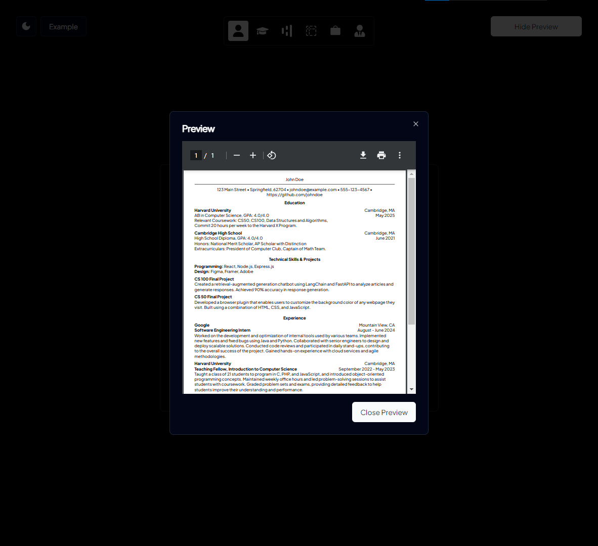

# Odin CV Application

Simple Tech CV generator created with [React](https://react.dev/), [Vite](https://vitejs.dev/), [React Router](https://reactrouter.com/en/main), and [shadcn/ui](https://ui.shadcn.com/).

## Result

Check out here! 😄

🔗 <https://lyzanderandrylie.github.io/odin-cv-application/>

## Requirements

To check out full requirements, click this [link](https://www.theodinproject.com/lessons/node-path-react-new-cv-application "Project: CV Application")  

## Screenshot

### Light Mode

### Dark Mode

